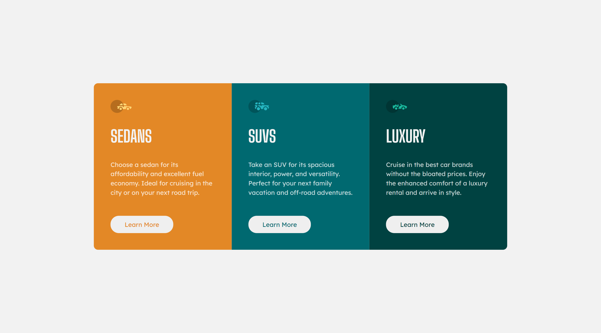
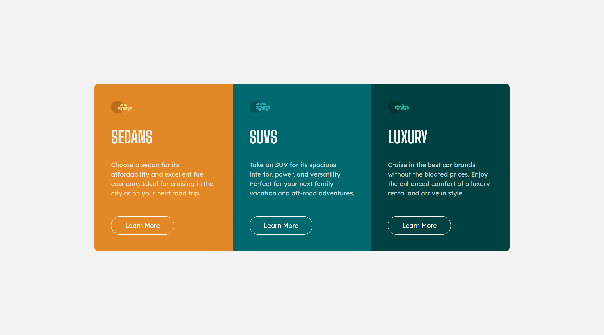

# FeM-3-column-preview-card-component

This is a solution to the [3-column preview card component challenge on Frontend Mentor](https://www.frontendmentor.io/challenges/3column-preview-card-component-pH92eAR2-). Frontend Mentor challenges help you improve your coding skills by building realistic projects. 

## Table of contents

- [Overview](#overview)
  - [Screenshot](#screenshot)
  - [Links](#links)
- [My process](#my-process)
  - [Built with](#built-with)
- [Author](#author)

## Overview

### Screenshot

### Links

- [Live Site URL](https://aristodev22.github.io/FeM-3-column-preview-card-component/)

## My process

### Built with

- Semantic HTML5 markup
- Flexbox CSS
- Responsive layout, looks good on mobile, tablet and desktop computers
- Mobile first approach

## Author

- Website - [Aristo Dev](https://www.aristodev.com)
- Frontend Mentor - [@AristoDev22](https://www.frontendmentor.io/profile/aristodev22)
- Twitter - [@AristoDev22](https://www.twitter.com/aristodev22)
